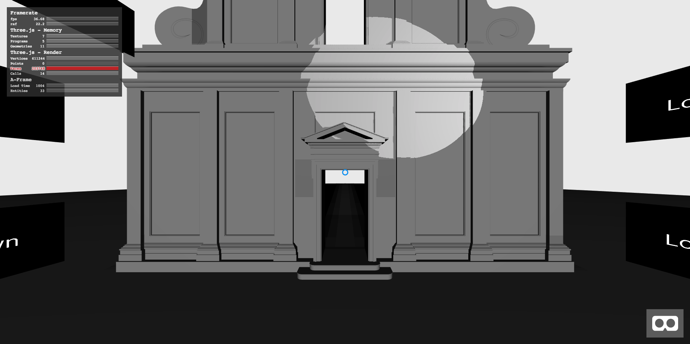
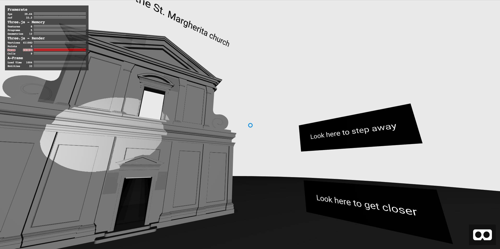
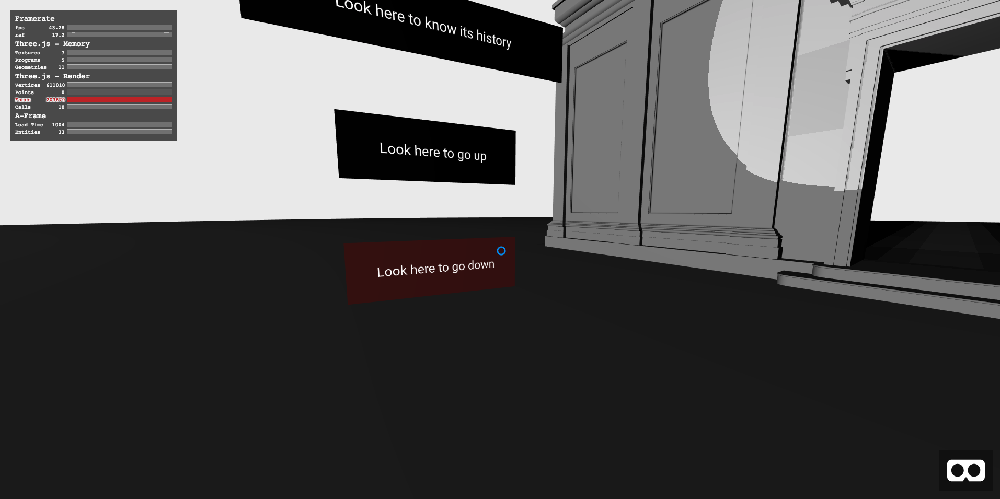

# A-Frame-example

A-Frame example showing the reconstructed facade of the St. Margherita church of l'Aquila (Italy) with some **light animation** and **interactive panels**. The interactive panels are also useful to move around the 3D map when you are using devices without controllers such as smartphones or tablets.

The model used here was obtained using photogrammetry and laser scanning techniques. The complete process is explained in this paper: [Augmented Reality for Historical Storytelling. The INCIPICT Project for the Reconstruction of Tangible and Intangible Image of L’Aquila Historical Centre
](https://www.researchgate.net/publication/321205949_Augmented_Reality_for_Historical_Storytelling_The_INCIPICT_Project_for_the_Reconstruction_of_Tangible_and_Intangible_Image_of_L'Aquila_Historical_Centre).

Open it on [https://pichillilorenzo.github.io/A-Frame-example/](https://pichillilorenzo.github.io/A-Frame-example/) to see the example.

**A-Frame compontents** defined in `main.js` are:
- **basic-material**: set a `THREE.MeshBasicMaterial` to an A-Frame entity.
- **show-history**: show the history of the church when an user look to the correspondent panel.
- **go-backward-history**: go to the next page of the history when an user look to the correspondent panel.
- **go-forward-history**: go to the prev page of the history when an user look to the correspondent panel.
- **hide-history**: hide the history panel when an user look to the correspondent panel.
- **look-at-camera**: entities with this attribute will always look at the camera.
- **follow-camera**: entities with this attribute will follow the camera.
- **animation-move**: create an infinite animation. it lets define the path of the animation and the animation time of each step. In the `path` value you can set an array of steps for the animation. In each step you can define the position and other properties (like the rotation) of the entity that will be updated. Example:
```html
<a-entity 
  light="type: spot; angle: 20; castShadow: true; intensity: .7;" 
  animation-move='path: [ 
    {"position": {"x": 0, "y": 0, "z": 1}, "rotation": {"x": 35, "y": -15, "z": 1}}, 
    {"position": {"x": -10, "y": 0, "z": 1}, "rotation": {"x": 35, "y": -35, "z": 0}}, 
    {"position": {"x": -10, "y": 25, "z": 1.5}, "rotation": {"x": -35, "y": -25, "z": 1}}, 
    {"position": {"x": 10, "y": 25, "z": 1.5}, "rotation": {"x": -35, "y": 30, "z": 1}}, 
    {"position": {"x": 10, "y": 0  , "z": 1}, "rotation": {"x": 30, "y": 35, "z": 1}} 
  ]; animationStepTime: 3000'>
</a-entity>
```
- **highlight**: highlight a panel when the user is looking at it.
- **move-camera**: will move the camera without using the keyboard when an user will look at the entity using this attribute. Example:
```html
<a-text 
  class="sign" 
  highlight 
  follow-camera="offset: -5 1 -2;" 
  rotation="0 80 0" 
  value="Look here to go up" 
  move-camera="position: 0 0.1 0;" 
  align="center">

  <a-plane color="#000" width="3"></a-plane>

</a-text>
```
When an user will look at it, the camera will move along the y axis by 0.1 each second, and 0 on the x and z axis.

### Screenshots


